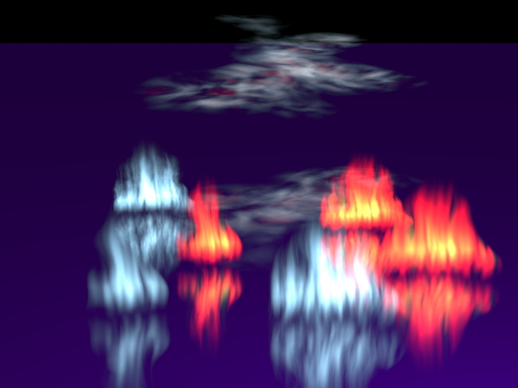

# Extension: VolumeEffects



### Author: Tomas Kalva

### Category: Animated scene component

### Namespace: TomasKalva

### Class name: VolumeCube : Cube, ISolid, ITimeDependent

### ITimeDependent: Yes

### Source file: VolumeCube.cs

This extension defines a new solid whose shape is given by a color density function. When a ray hits the solid, the color is calculated by integrating the density function on the ray. 

The class ``VolumeCube`` contains some predefined color density functions - fire, cloud, noise, . . . These functions can be passed as delegates to the constructor of ``VolumeCube``.

An example of creation of ``VolumeCube`` is in the scene ``VolumeCubeSmall.cs``:

```
// Create noises that are used as parameters for fire
Intensity noise = VolumeCube.Noise3d();
Intensity turbulence = VolumeCube.Turbulence(noise, 4);

// Define the shape of the entire fire
Intensity fireShape = VolumeCube.ParaboloidFireShape(new Vector3d(0.5, 1.0, 0.5), new Vector3d(0.5, -1.0, 0.5));

// Define the color for a point with the given intensity, colors are vectors with rgb components
Func<double, Vector3d> fireColorYellow = intensity => Vector3d.Lerp(new Vector3d(0.920, 0.0, 0.0), new Vector3d(0.916, 0.930, 0.122), intensity);

// Create fire by defining its shape, texture, color, intensity and speed of burning 
AnimatedColor fire = VolumeCube.Fire(fireShape, turbulence, noise, fireColorYellow, 1.0, 10.0);

// Create a new VolumeCube with the fire object as its color density
ISolid c = new VolumeCube(fire);
root.InsertChild(c, Matrix4d.Scale(4) * Matrix4d.CreateTranslation(0.0, 0.0, 0.0));
```

The color density function that ``VolumeCube`` takes in constructor has type ``AnimatedColor`` which depends on time. To animate the object the it's enough to have density function that uses the time parameter:

```
AnimatedColor animated = (position, time) => (time % 1.0) * Vector3d.One;
```

## Noise

The module uses perlin noise defined in the file ``Noise.cs``. It contains 2d, 3d and 4d perlin noise. All the noises are accessible as delegates from the ``VolumeCube`` which also defines turbulence. 

## Examples

The module contains two example scenes: ``VolumeCubeSmall.cs`` with an example of the usage and ``VolumeCubeLarge.cs`` with multiple objects. Both scenes are animated.

Video: 

[YouTube video 640x360](https://youtu.be/hmvnIp33ZCg)